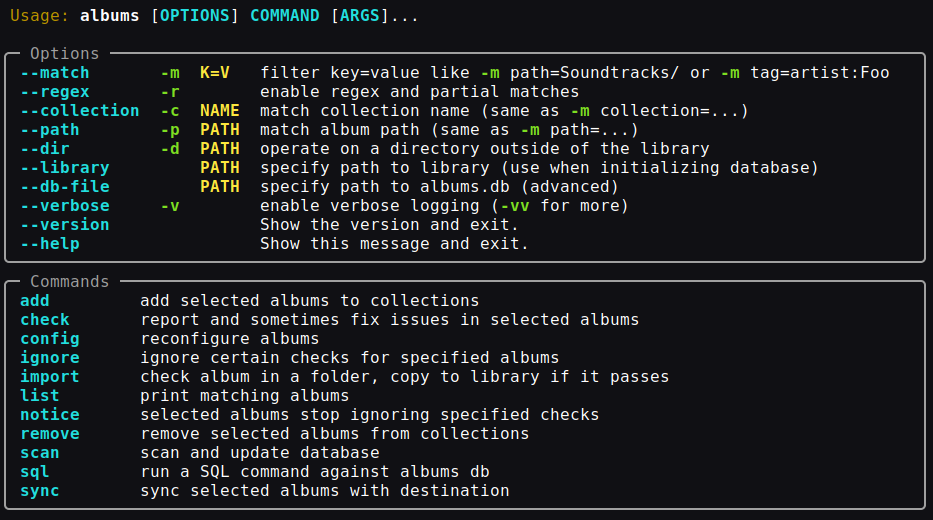

# Overview

`albums` is an interactive tool to manage music: configurably validate and fix
tags and metadata, rename files, reformat and embed album art, import albums,
and sync parts of the library to digital audio players or portable storage

This documentation is for `albums` version **%%version_placeholder%%**.

## License

`albums` is free software, licensed under the terms of the
[GNU General Public License Version 3](https://github.com/4levity/albums/blob/main/COPYING)

## Getting started

**Installation Option 1:** In an environment with Python 3.12 or newer, run
`pipx install albums`

**Installation Option 2 _(64-bit Linux and Windows only)_:** Download the
[self-contained binary release from GitHub](https://github.com/4levity/albums/releases).
Extract the contents to a folder and add that folder to your PATH.

Each album (soundtrack, mixtape...) is expected to be in a folder, or `albums`
won't be helpful.

To immediately start scanning for issues in a single album or a few albums, with
default settings, run: `albums --dir /path/to/an/album check`. Add `--fix` at
the end to see repair options or `--help` for more choices. Using the `--dir`
(or `-d`) option, no data is stored between runs.

Albums can store information about a library of music in its database. Run
`albums scan` (without the `--dir` option) to get started. It will ask you to
confirm whether your music library is in the default user home directory
location (e.g. `~/Music`). It may take several minutes to index a large
collection. Configuration settings are also stored in the database and can be
customized by running `albums config`. See [Usage](./usage.md).

## Supported Formats

**FLAC**, **Ogg Vorbis**, **MP3/ID3**, **M4A**, **ASF/WMA** and **AIFF**
containers/types are supported with standard tags. **ASF/WMA** embedded image
support is read-only. Image files (PNG, JPEG, GIF, BMP, WEBP, TIFF, etc) in the
album folder are scanned and can be automatically converted and embedded.

## System Requirements

Requires Python 3.12+. Primarily tested on Linux and Windows. Should work on
almost any 64-bit x86 or ARM system with Linux, macOS or Windows. (32-bit and
wider OS support possible by dropping `scikit-image` library used for measuring
image similarity.)
